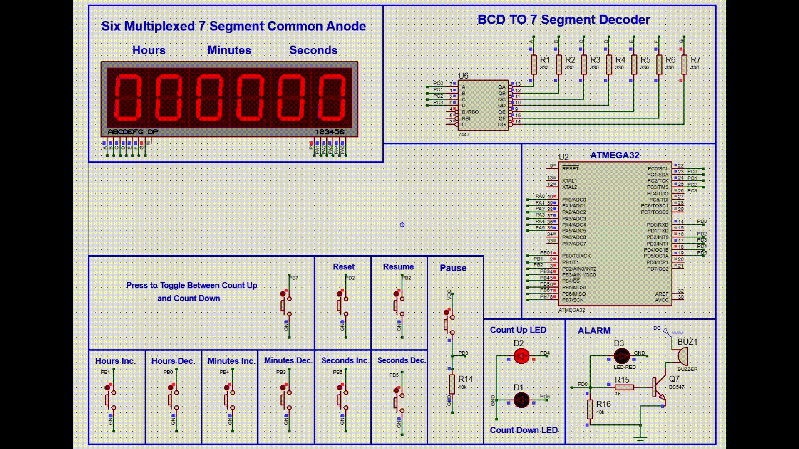

# Dual-Mode Stopwatch  

 

## Overview  
This project is a **Dual-Mode Stopwatch** implemented on an **AVR microcontroller (ATmega32)** and simulated using **Proteus**. The stopwatch operates in two modes:  

- **Count-Up Mode** (Normal Stopwatch Mode)  
- **Count-Down Mode** (Timer Mode)  

Users can pause, resume, reset, and manually adjust time settings using push buttons. The time is displayed on **a 6-digit 7-segment display**, and an **alarm system** is activated when the countdown timer reaches zero.  

## Features  
✔ **Dual Mode Operation**  
- The stopwatch can **count up** (increment time) or **count down** (decrement time).  
- Mode can be toggled using a push button.  

✔ **Time Adjustment**  
- While paused, users can manually adjust **hours, minutes, and seconds** using dedicated buttons.  

✔ **Pause and Resume (External Interrupts)**  
- The stopwatch can be **paused and resumed** using **external interrupts (INT1 and INT2)**.  

✔ **Reset Functionality (External Interrupts)**  
- Pressing the reset button triggers an **external interrupt (INT0)**, setting the stopwatch to **00:00:00** and switching it back to **count-up mode**.  

✔ **Timer-Based Operation**  
- Uses **16-bit Timer1 in CTC (Clear Timer on Compare) Mode**, generating an **interrupt every second** to update the time. (Refer to [Datasheet][docs/ATmega32.pdf])

✔ **Visual Indicators**  
- **LED indicators** to show the current mode (count-up/count-down).  
- **Alarm activation** when the countdown reaches zero.  

## Components Used  
- **ATmega32** (Microcontroller)  
- **6-digit 7-Segment Display** (Time Display)  
- **Push Buttons** (Mode toggle, Start/Pause, Resume, Reset, Manual time adjustment)  
- **LED Indicators** (Shows count-up or count-down mode)  
- **Buzzer** (Alarm when countdown reaches zero)  
- **16-bit Timer1 (CTC Mode, 1s Interrupt Generation)**  
- **External Interrupts (INT0, INT1, INT2) for Reset, Pause, and Resume**  
- **Proteus Simulation**  

## Circuit and Simulation (Proteus)  
The circuit is designed and simulated in **Proteus**. It includes:  
- A **7-segment multiplexed display** connected to **PORTA and PORTC**.  
- **Push buttons** connected to **PORTB** for user interactions.  
- **LED indicators and buzzer** connected to **PORTD**.  
- **Timer1 in CTC mode** to generate time updates every second.  
- **External interrupts** to handle **reset, pause, and resume** functions.  

## How It Works  
1. **Startup**: The stopwatch starts in **count-up mode**.  
2. **Pause & Resume**: Pressing the **pause button (INT1)** stops the time, and pressing the **resume button (INT2)** restarts it.  
3. **Reset**: Pressing the **reset button (INT0)** sets the time to **00:00:00** and switches back to count-up mode.  
4. **Time Adjustment**: While paused, buttons allow modifying **hours, minutes, and seconds**.  
5. **Mode Toggle**: Pressing the mode button switches between **count-up and count-down modes**.  
6. **Countdown Alarm**: If the timer reaches **00:00:00**, the buzzer activates.  

## How to Simulate in Proteus  
1. Open **Proteus** and load the provided **circuit file**.  
2. Compile the **C code** using **AVR-GCC** or **Atmel Studio** and generate a **.hex file**.  
3. Load the **.hex file** into the ATmega32 microcontroller in Proteus.  
4. Run the simulation and interact with the stopwatch using buttons.  

## Future Improvements  
- **RTC Module Integration** for real-time tracking.  
- **EEPROM Storage** to retain stopwatch state after reset/power-off.  
- **OLED or LCD Display** for improved readability.  

## Author  
👤 **Malik Babiker**  
📅 **Feb 12, 2025**  

---

This project is a great learning experience for **AVR timers, external interrupts, and 7-segment multiplexing**. 🚀
